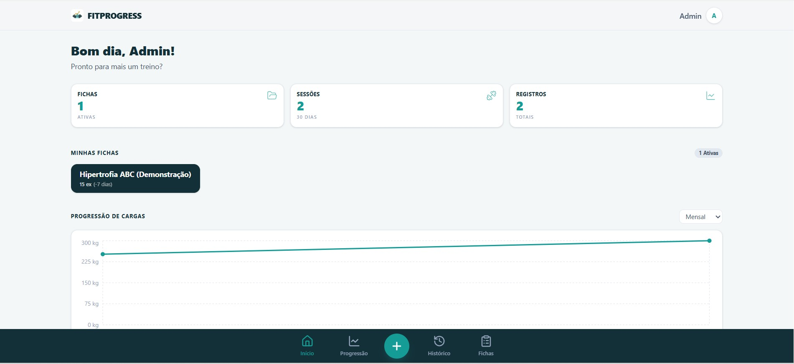
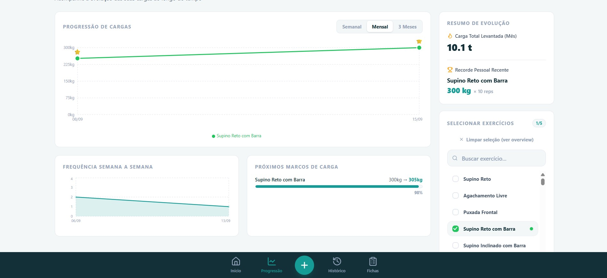

# FITPROGRESS

> Aplicação web para registro de treinos, acompanhamento de desempenho e visualização de evolução ao longo do tempo.

[](https://react.dev/)
[](https://vite.dev/)
[](https://tailwindcss.com/)
[](https://supabase.com/)

---

## 🚀 Demonstração

A aplicação está disponível online e pode ser testada diretamente pelo navegador:

👉 **[Acessar o FITPROGRESS](https://ficha-de-treino-mocha.vercel.app)**

---

### Dashboard



### Treino


### Progressão



---

## ℹ️ Sobre o projeto

O **FITPROGRESS** é um projeto pessoal desenvolvido como aplicação prática de aprendizado e portfólio.

A ideia surgiu de uma necessidade simples: transformar o registro de exercícios, cargas e repetições em um histórico estruturado e útil para acompanhar a progressão de carga ao longo do tempo na academia.

O projeto foi construído para explorar e consolidar conceitos fundamentais de desenvolvimento web moderno:

* **Frontend moderno** com React 19 e Tailwind CSS 4;
* **Gerenciamento de estado global** simples e veloz com Zustand;
* **Autenticação segura** e persistência de sessão;
* **Banco de dados relacional** com PostgreSQL no Supabase;
* **Isolamento de dados por usuário** utilizando Row Level Security (RLS);
* **Arquitetura desacoplada** com separação entre estado de UI e camada de repositórios/sincronização;
* **Design responsivo** com abordagem mobile-first para facilidade de uso durante o treino.

---

## 🏋️ Funcionalidades

### Treinos
* **Gerenciamento de fichas**: Criação, edição e exclusão de fichas de treino (ex: Treino A, B, C);
* **Organização dos exercícios**: Definição de séries alvos, repetições e cargas estimadas por exercício;
* **Execução interativa**: Marcação visual de séries concluídas em tempo real durante a sessão de treino, com flexibilidade para ajustar ou desmarcar séries finalizadas;
* **Troca dinâmica de exercício**: Permite substituir um exercício durante a execução do treino (ex: trocar Supino Reto por Voador se o aparelho estiver ocupado), mantendo a estrutura de séries;
* **Histórico de sessões**: Salvamento automático dos treinos realizados com data, duração e registro exato das cargas executadas.

### 📈 Progressão
* **Histórico de cargas e repetições**: Acompanhamento detalhado da evolução em cada exercício;
* **Visualização gráfica**: Gráficos de evolução baseados nos dados reais de treino inseridos pelo usuário;
* **Registro de máximas**: Identificação de cargas máximas atingidas por exercício ao longo do tempo.

### 🔐 Autenticação e Segurança
* **Autenticação completa**: Cadastro de novos usuários, login, logout e restauração automática de sessão;
* **Proteção de rotas**: Acesso restrito a usuários autenticados;
* **Isolamento de dados por usuário**: Garantia no nível de banco de dados (RLS) de que cada usuário acesse exclusivamente suas próprias fichas e histórico.

### 📱 Experiência do Usuário (UX)
* **Interface mobile-first**: Otimizada para telas de smartphones, priorizando toque rápido e legibilidade durante a atividade física;
* **Estados de interface**: Tratamento completo para estados de carregamento (loading), erros de rede e listas vazias;
* **Ficha de demonstração**: Criação automática de uma ficha de exemplo ("Hipertrofia ABC") para novos usuários explorarem o app sem a necessidade de cadastrar tudo do zero.

---

## 🛠️ Tecnologias

### Frontend
* **[React 19](https://react.dev/)** — Biblioteca principal para construção da interface declarativa e reativa;
* **[Vite](https://vite.dev/)** — Tooling rápido para build e ambiente de desenvolvimento;
* **[Tailwind CSS 4](https://tailwindcss.com/)** — Estilização utilitária moderna e responsiva;
* **[Zustand](https://github.com/pmndrs/zustand)** — Gerenciamento de estado global leve e reativo;
* **[Lucide React](https://lucide.dev/)** — Ícones minimalistas;
* **[Recharts](https://recharts.org/)** — Visualização gráfica de evolução de cargas.

### Backend / Dados
* **[Supabase](https://supabase.com/)** — Backend-as-a-Service para banco de dados e autenticação;
* **[PostgreSQL](https://www.postgresql.org/)** — Banco de dados relacional;
* **Supabase Auth** — Gerenciamento de usuários e controle de sessões JWT;
* **Row Level Security (RLS)** — Regras de segurança no banco para isolamento estrito de dados entre usuários.

---

## 🏗️ Arquitetura simplificada

A aplicação adota uma arquitetura predominantemente client-side com separação clara de responsabilidades:

```text
               ┌─────────────────────────┐
               │        React UI         │
               │   (Componentes & Pages) │
               └────────────┬────────────┘
                            │
                            ▼
               ┌─────────────────────────┐
               │      Zustand Store      │
               │  (Estado local rápido)  │
               └────────────┬────────────┘
                            │
                            ▼
               ┌─────────────────────────┐
               │    Data Repositories    │
               │   (Camada de acesso)    │
               └────────────┬────────────┘
                            │
                            ▼
               ┌─────────────────────────┐
               │     Supabase Client     │
               │  (Auth & REST API SDK)  │
               └────────────┬────────────┘
                            │
                            ▼
               ┌─────────────────────────┐
               │   PostgreSQL + RLS      │
               │  (Persistência segura)  │
               └─────────────────────────┘
```

---

## 🔒 Segurança e isolamento de dados

O FITPROGRESS aplica o princípio do menor privilégio e isolamento rigoroso entre contas de usuários:

* **Row Level Security (RLS)**: Cada tabela no PostgreSQL possui políticas que vinculam a leitura, gravação e exclusão ao ID do usuário autenticado (`auth.uid() = user_id`).

```text
Usuário A  ──► [RLS Policy] ──► Fichas A  | Treinos A  | Histórico A
Usuário B  ──► [RLS Policy] ──► Fichas B  | Treinos B  | Histórico B
```

* **Credenciais Públicas**: O frontend utiliza apenas a URL pública e a `ANON_KEY` do Supabase. Nenhuma chave administrativa (`SERVICE_ROLE_KEY`) é exposta no código cliente.

---

## 💾 Dados de demonstração

Para evitar que um novo usuário encontre uma interface totalmente vazia no primeiro acesso, o FITPROGRESS disponibiliza uma **Ficha de Demonstração ("Hipertrofia ABC")**.

* Contém treinos pré-configurados com exercícios, cargas e repetições fictícias;
* É vinculada diretamente à conta do novo usuário no momento da criação;
* Pode ser livremente editada, personalizada ou excluída a qualquer momento;
* Permite testar a navegação e a execução do treino imediatamente.

---

## 💻 Como executar localmente

### Pré-requisitos
* [Node.js](https://nodejs.org/) (versão 18 ou superior);
* `npm` ou gerenciador de pacotes equivalente;
* Uma conta no [Supabase](https://supabase.com/) com um projeto configurado (para o banco de dados).

### Passos para instalação

1. **Clone o repositório:**
   ```bash
   git clone https://github.com/seu-usuario/fitprogress.git
   cd fitprogress
   ```

2. **Instale as dependências:**
   ```bash
   npm install
   ```

3. **Configure as variáveis de ambiente:**
   Crie um arquivo `.env.local` na raiz do projeto com as credenciais do seu projeto Supabase:
   ```env
   VITE_SUPABASE_URL=https://seu-projeto.supabase.co
   VITE_SUPABASE_ANON_KEY=sua_chave_anonima_publica
   ```

4. **Inicie o servidor de desenvolvimento:**
   ```bash
   npm run dev
   ```

5. **Acesse no navegador:**
   O terminal exibirá o endereço local (geralmente `http://localhost:5173`).

---

## 📜 Scripts disponíveis

| Comando | Descrição |
| :--- | :--- |
| `npm run dev` | Inicia o servidor de desenvolvimento com Vite |
| `npm run build` | Compila a aplicação para produção na pasta `dist` |
| `npm run lint` | Executa o linter para checagem estática do código |

---

## 🌐 Deploy

A aplicação está configurada para deploy contínuo na **Vercel**, conectada ao repositório do projeto com variáveis de ambiente configuradas no painel da plataforma.

👉 **[Acessar FITPROGRESS em Produção](https://ficha-de-treino-mocha.vercel.app)**

---

## 💡 Principais desafios e aprendizados

Durante o desenvolvimento deste projeto de portfólio, os principais aprendizados práticos foram:

1. **Gerenciamento de Estado Reativo**: Utilização do Zustand para manter a interface responsiva e sincronizada sem re-renderizações desnecessárias.
2. **Segurança no Banco de Dados (RLS)**: Aplicação de políticas Row Level Security no PostgreSQL para garantir a segurança dos dados no próprio banco de dados, e não apenas no frontend.
3. **Desenvolvimento Mobile-First**: Criação de fluxos de telas focados em usabilidade rápida para telas pequenas, simulando o uso prático dentro da academia.
4. **Sincronização de Dados**: Separação entre o estado visual imediato da interface e a comunicação assíncrona com o backend.

---

## 🗺️ Roadmap

Ideias para evolução futura do projeto:

- [ ] Melhorias na análise de progressão com novos tipos de gráficos;
- [ ] Cálculo de volume total por treino ($séries \times repetições \times carga$);
- [ ] Timer de descanso integrado entre as séries;
- [ ] Exportação de histórico de treinos em formato CSV/PDF.

---

## 📌 Status do Projeto

> **Aplicação funcional desenvolvida como projeto pessoal de aprendizado e portfólio.**

---

## 👤 Autor

**Pedro Parreira**

Projeto pessoal desenvolvido para aplicação prática e consolidação de conhecimentos em desenvolvimento de software web.
